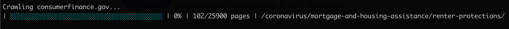

# crawsqueal 🦜

Crawl a website, save its content to a SQLite database, and search it in your browser.



## Quickstart

Run the crawler without needing to download this repository:

```
npx cfpb/crawsqueal
```

It'll create a SQLite database named `./crawl.sqlite3`, crawl the consumerfinance.gov website, and create a record for every page that has a unique URL (including query params and hashes). This takes a couple of hours to complete.

## Running the crawler locally

To run using a local copy of this repository:

```
yarn
yarn start
```

You can optionally pass a custom filename for the database:

```
yarn start cfpb/crawsqueal db.sqlite3
```

You can also optionally pass an alternate domain name to crawl:

```
yarn start db.sqlite3 https://beta.consumerfinance.gov/
```

### Experimental: Generate a crawl database from a WARC archive

A [WARC](https://archive-it.org/blog/post/the-stack-warc-file/)
(Web ARChive)  is a container file standard for storing web content in its original context,
maintained by the International Internet Preservation Consortium (IIPC).

Many tools exist to generate WARCs.
The Internet Archive maintains the
[Heritrix](https://github.com/internetarchive/heritrix3) web crawler that can generate WARCs;
a longer list of additional tools for this purpose can be found
[here](http://dhamaniasad.github.io/WARCTools/).

The common command-line tool
[wget](https://wiki.archiveteam.org/index.php/Wget_with_WARC_output)
can also be used to generate WARCs. A sample script to do so can be found in this repository,
and can be invoked like this:

```sh
./wget_crawl.sh https://www.consumerfinance.gov/
```

This will generate a WARC archive file named `crawl.warc.gz`.
This file can then be converted to a SQLite database using a command like:

```sh
./read_warc.py create-db crawl.warc.gz crawl.sqlite3
```

## How to query the crawler database

You can use the
[SQLite command-line client](https://www.sqlite.org/cli.html)
to make queries against the crawl result,
or a graphical client such as [DB4S](https://github.com/sqlitebrowser/sqlitebrowser) if you prefer.

To run the command-line client:

```
sqlite3 crawl.sqlite3
```

The following examples describe some common use cases.

### Dump database statistics

To list the total number of URLs and crawl timestamps:

```sql
sqlite> SELECT COUNT(*), MIN(timestamp), MAX(timestamp) FROM crawl;
25279|2022-04-11T04:00:12.336Z|2022-04-11T06:18:11.608Z
```

Note that page data is stored in a table named `cfgov`.

### List pages that link to a certain URL

```sql
sqlite> SELECT DISTINCT cfgov.path FROM cfgov, json_each(json(cfgov.links)) WHERE json_each.value LIKE '/plain-writing/' ORDER BY cfgov.path;
```

To dump results to a CSV instead of the terminal:

```sql
sqlite> .mode csv
sqlite> .output filename.csv
sqlite> ... run your query here
sqlite> .output stdout
sqlite> .mode list
```

To search with wildcards, use the `%` character:

```sql
sqlite> SELECT cfgov.path, json_each.value AS link FROM cfgov, json_each(json(cfgov.links)) WHERE json_each.value LIKE '/about-us/blog/%' ORDER BY cfgov.path, link;
```

### List pages that contain a specific design component

```sql
sqlite> SELECT DISTINCT cfgov.path FROM cfgov, json_each(json(cfgov.components)) WHERE json_each.value LIKE 'o-featured-content-module' ORDER BY cfgov.path;
```

See the [CFPB Design System](https://cfpb.github.io/design-system/)
for a list of common components used on CFPB websites.

### List pages that contain a certain phrase

```sql
sqlite> SELECT path FROM cfgov_fts WHERE cfgov_fts MATCH 'diamonds' ORDER BY path;
```

Note that this query uses a distinct `cfgov_fts` table that uses the SQLite [FTS5 extension](https://www.sqlite.org/fts5.html) for full-text search.

## Running the viewer application

From the repo's root, compile front-end assets:

```
yarn
yarn build
```

Create a Python virtual environment and install requirements:

```
python3.8 -m venv venv
source venv/bin/activate
pip install -r viewer/requirements.txt
```

Optionally set the `CRAWL_DATABASE` environment variable to point to a local crawl database:

```
export CRAWL_DATABASE=cfgov.sqlite3
```

Finally, run the Django webserver:

```
viewer/manage.py runserver
```

The viewer application will be available locally at http://localhost:8000.

## Development

### Testing

To run Python unit tests, use [`tox`](https://tox.wiki/en/latest/):

```
tox
```

### Sample database file

This repository includes a sample database file ([sample.sqlite3](./sample.sqlite3)).
This file is used by the viewer application when no other crawl database file has been specified.
It is also used for Python unit testing purposes.

The source website content used to generate this file is included in this repository
under the [sample](./sample) subdirectory. To regenerate the test database from this content,
first serve the sample website locally:

```
cd sample
python -m http.server
```

Then, in another terminal at the repository root, start the crawler against the locally running site:

```
yarn start sample.sqlite3 http://localhost:8000/
```

You'll need to delete the existing sample database file before starting the crawler.

----

## Open source licensing info
1. [TERMS](TERMS.md)
2. [LICENSE](LICENSE)
3. [CFPB Source Code Policy](https://github.com/cfpb/source-code-policy/)
